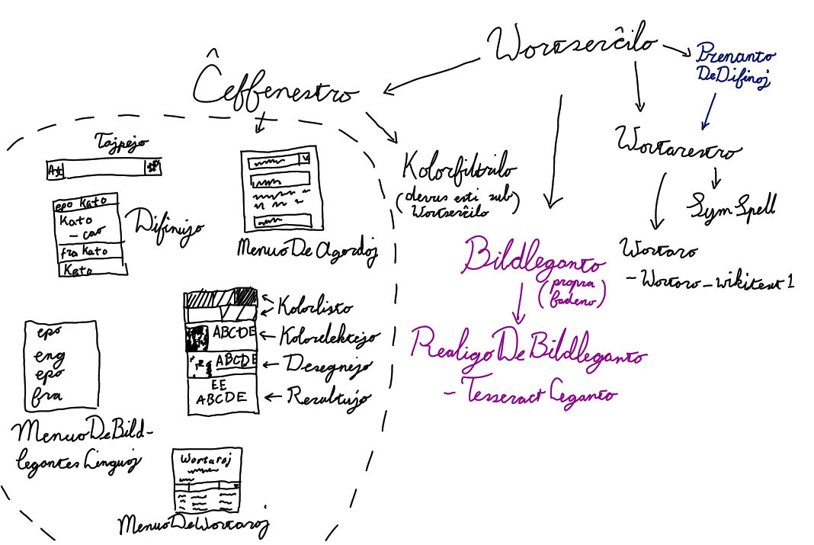

# La Iom Rapida Vortarilo

Kun la Iom Rapida Vortarilo oni povas trovi difinon de vorto per nur meti kursoro sur ĝi kaj premi alt + x. Ĉi vortaro
uzas bildleganton, do ĝi ne ĉiam donas la ĝustan rezulton, sed ĝi enhavas kelkajn ilojn per kiuj oni povas
plibonigi la legadrezultojn. Krom alt + x, oni ankaŭ povas trovi difinojn per kopii la vorton kaj premi alt + c.

La Iom Rapida Vortarilo devus funkcii kun ĉiu lingvo, almenaŭ ĉiu lingvo en la angla Vikivortaro. Mi ankoraŭ nur duone
realigis ke oni povas uzi aliajn fontojn de difinojn ol la angla Vikivortaro, plejparte ĉar mi nur kreis
formatkonvertanton por tiu vortaro. Ĝi povas funkcii sen interreto. Mi intenciis ke ĝi funkcias tute sen interreto
norme, sed bedaŭrinde konverti Vikitekston al HTML estas malfacilan kaj ne estis klara al mi ĉu la disponeblaj neretaj
konvertiloj bonis, do ĝi uzas la retan Parsoid servon de la Vikivortaro mem. La konverto ne necesas ĉar oni povas
legi la difinojn el la Vikitekston, kvankam tio ne estas tre bela. Vi ankaŭ povas ruli Parsoid sur via propra komputilo
sed ĝi estas iom malfacilan. Mi kreis gvidilon por fari tion sur Debian: [ligo](dok/Parsoid-sur-Debian.md).

La programo ankoraŭ enhavas kelkajn cimojn:
 - Se vi elektas novajn vortarojn dum ke la programo ankoraŭ ŝarĝas vortarojn, la fasado frostas por iom da tempo.
 - La plej granda vortaro, la angla vortaro, bezonas pli ol unu gigabajto de labormemoro.
 - Oni bezonas musradon por trairi la fasadon.
 - La programo uzas la vortlimojn kiujn Tesseract donas al ĝi, sed tiuj limoj ofte malĝustas por lingvoj kiuj ne uzas
   spacon por separi vortojn, kiel orientaj lingvoj. Almenaŭ ĝi norme ĝuste divenas la karakterojn.

## Uzado

Kiam la programo ĵus komencis, ŝanĝu la agordojn se vi volas ŝanĝi ion, kaj tiam klaku al la butono en la supra
maldekstra angulo de la fenestro. Elektu la vortarojn de la lingvoj de kies vortoj vi volas havi difinojn.

Vi nun povas serĉi difinojn per tajpi ĝin en la supra tajpejo, per kopii vorton kaj premi alt + c aŭ per meti kursoron
super la vorton kaj premi alt + x. Je Linux, alt + c uzas elektitan tekston anstataŭ kopiita teksto krom se vi elektis
la malan en la agordoj.

Alt + x uzas bildleganton, kiu ne ĉiam perfekte funkcias. Oni povas plibonigi la rezultojn per uzi la bildleganto-paĝon,
al kiu oni povas iri per ruli la musradon supren ĉe la difinoj-paĝon. La bildleganto-paĝo montras ekranbildon de la zono
kiu estis sub la kursoro, blanknigran version de tiu bildon kaj la vortojn kiujn la bildleganto legis el la
blanknigra versio. Por plibonigi la rezultojn oni devas klarigi la tekston en la blankigra bildo. Plue la bildleganto
povas fuŝi la legadon se ioj nigraj estas proksiman al la volata teksto. Tial se la rezulto malbonas, oni devus viŝi
iojn nigrajn kiuj ne estas tekston en la blanknigra bildo.

Klavoj en la kolora ekranbildo:
 - Maldekstre klaki koloron markas ĝin kiel tekstkoloro.
 - Dekstre klaki koloron markas ĝin kiel fonkoloro.
 - Ruli la musradon zomas. Zomi ankaŭ metas la punkton sub la kursoro en la centro de la fenestro.

Tekst- kaj fonkoloroj daŭras inter uzoj de ctrl + x. Vi povas forpreni ilin per klaki al ili en la trabo kiu aperas ĉe
la supro de la bildleganto-paĝo.

Klavoj en la blanknigra bildo:
 - Maldekstre klaki la bildon farbas ĝin blanke.
 - Dekstre klaki la bildon farbas ĝin nigre.
 - Meze klaki la bildon viŝas vian farbon.
 - Maldekstre klaki la bildon dum ke vi premas ctrl inundas zonon kun blanko.
 - Maldekstre klaki la bildon dum ke vi premas alt inundas zonon kun nigro.
 - Ruli la musradon zomas. Zomi ankaŭ metas la punkton sub la kursoro en la centro de la fenestro.
 - Ruli la musradon dum ke vi premas shift ŝanĝas la grandon de la broŝo.

Blanke farbi la bildon kaj inundi ĝin kun blanko estas la plej utilajn.

## Eldonoj

Oni provas trovi binarajn eldonojn ĉe <https://github.com/zvd2/wortserchilo-binaraj>.

## Kompili

Por kompili ĉi programo oni bezonas le jenajn funkciarojn:
 - Tesseract 4
 - Leptonica
 - ZipIOS++ 2
 - CURL
 - CURL++
 - Qt5Widgets
 - UGlobalHotkeys
 - YAML-CPP
 - Boost 1.62 serialization, iostreams, system kaj unit_test_framework
 - ICU 60 unicode (uc) kaj internationalization (i18n).
 
La Debian pakaĵujo ne enhavas ZipIOS 2 aŭ UGlobalHotkeys, la aliaj funkciaroj estas en la jenaj pakaĵoj:
```
libtesseract-dev libleptonica-dev libcurl-4-gnutls-dev libcurlpp-dev libyaml-cpp-dev libboost-system1.62-dev libboost-iostreams1.62-dev libboost-serialization1.62-dev libboost-test1.62-dev libqt5widgets5 libicu-dev
```

## Helpi

Se vi ne povas programi ion-ajn, vi ankoraŭ povas helpi en la jenaj manieroj:
 - Laboru al la [VikiVortaron](https://www.wiktionary.org) aŭ iun-ajn alian fonton de vortaroj.
 - [Traduku la fasadon.](dok/traduki-la-fasadon.md)
 - [Traduku la liston de lingvoj.](https://hosted.weblate.org/projects/iso-codes/iso-639-3/)

#### Kodo

Vi povas trovi sugestojn por plibonigoj en la issue-paĝo.

Se vi volas helpi per aldoni kodon, vi devas scii ke:
 - La fontkodo ne estas en decan Esperanto sed en mia propra iom malsimila Esperanto. La diferencoj:
    - «qŭ» anstataŭ «kv» ĉar ĝi estas pli rekoneblan, ekzemple «freqŭenco» anstataŭ «frekvenco».
    - Mi uzas «x» kaj «w», ekzemple «exemple» anstataŭ «ekzemple».
    - «se ... te ...» anstataŭ «se ... tiam ...».
    - «-es» por la genitivo, kaj «mies» ktp anstataŭ «mia». Ekzemple mi povas uzi «la knabes pilko»
      anstataŭ «la pilko de la knabo», kvankam mi ankoraŭ ankaŭ uzas la duan.
    - Mi uzas la akuzativon kun «esti», ekzemple «ĝi estas belan» anstataŭ «ĝi estas bela».
   
   Mia kodo ne perfekte unuforme uzas tiujn malsimilecojn ĉar partoj de la kodo estas pli malnova ol tiuj ideoj.
 - La fontkodo enhavas karakterojn ekster ASCII, ĉefe la ĉapliterojn. Mi kredas ke G++ ankoraŭ ne subtenas karakterojn
   ekster ASCII, do oni devas anstataŭe uzi Clang++, kiu ĝue havas la saman fasadon. Mi estas certan pri ke se vi konas
   Esperanton sufiĉe bone por legi ĉi dosieron, vi povas tajpi ĉapliterojn, sed mi ankaŭ uzas «ℤ», «ℕ» kaj «ℚ» por la
   specoj de numeroj. Se vi uzas XCompose sur Linux, vi povas enmeti [miajn XCompose klavligojn](./dok/XCompose). Se vi
   uzas alian karakterkomponilon, vi ankoraŭ povas uzi ĝin kiel referenco.
 - La fontkodo kutime mankas priskribantajn komentojn, sed
   almenaŭ miaj nomoj priskribas la celon de iliaj variebloj iom.

Mi mem verŝajne ne plu laboros al ĉi programo, ĉar mi havas aliajn projektojn al kiuj mi volas labori. Se vi volas
realigi aŭ ripari ion, kreu «issue»-on kaj mi eble provos helpi vin iom per informon pri la programarĥitekturon kaj pri
kiel vi povas realigi ion. Mi ankoraŭ traktos enmetadpetojn, kaj mi ordigos cimo-raportojn kaj petojn por novaj eblecoj,
kvankam mi mem verŝajne ne plenumos ilin.

