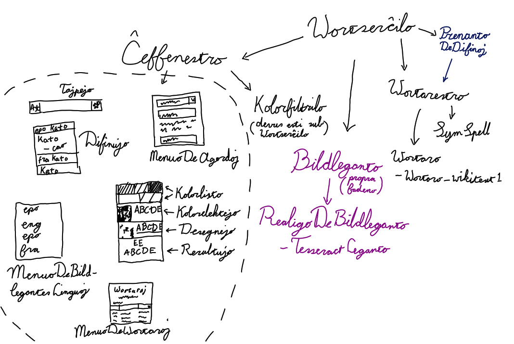

# The Somewhat Fast Dictionary

With The Somewhat Fast Dictionary you can point your cursor at a word, press alt + x and maybe get a definition of the
word you were pointing at. This program features an extensive set of tools (two of them) which you can use to try to
make the results less bad. Alternatively you can copy the word into the clipboard and press alt + c, which gives the
definition without doing the unreliable OCR step.

This is an OCR dictionary, which means it makes an attempt at reading things from images and screenshots. It doesn't
always do it all that well but it does always try. This is meant to work with every language but right now it works a
little better with western languages than with eastern languages. It was meant to be able to provide definitions from
multiple sources at the same time but I only made a program to format the definitions of the English Wiktionary and I
didn't fully implement using dictionaries from any other source yet.

This program was also meant to be fully offline but as it turns out converting Wikitext into HTML is really difficult
and finding a library that does it for C or C++ with proper documentation is even more difficult. In the end it still
relies on the Wiktionary's online Parsoid service to do that conversion. The conversion process is optional however as
you can read definitions from the Wikitext just fine. By leaving the conversion step out you can still use it offline.
You can also host a Parsoid server on your local machine, but Parsoid needs a Mediawiki set up so it's quite a hassle.
I made a guide for doing it but the guide is in Esperanto and only for Debian: [link](./dok/Parsoid sur Debian.md).

This program has several easter eggs for you to find, such as:
 - The English dictionary currently takes over a gigabyte of RAM.
 - The program uses Tesseract's word boundaries for alt + x. For languages which don't use spacing to seperate words 
 (like East Asian languages) these aren't very good, although at least it usually gets the characters right.
 - A scroll wheel is necessary for navigating the interface.
 - If you select new dictionaries while dictionaries are still being loaded the GUI freezes for a while.

## Usage

After opening the program, select some dictionaries in the language tab. Unfortunately the software I'm using for word
lists right now doesn't support keeping things on the hard drive, so loading the English dictionary, which is the
largest, will take a little over a gigabyte of RAM. Fortunately the other dictionaries aren't as big as the English
one.

Get word definitions by typing the word into the search bar, copying the word into the clipboard and pressing alt + c or
by pointing your cursor at the word and pressing alt + x. On Linux, alt + c by default uses selected text instead of the
text in the clipboard.

The alt + x technique uses OCR, which doesn't always work perfectly, but you can improve the results using the OCR
screen. You can get to the OCR screen by scrolling up in the definitions screen. The OCR screen shows the screenshot, 
a black and white version of the screenshot and the words that Tesseract read from the black and white version. To get
better results we need to ensure that the text is as clear as possible in the black and white image. Furthermore, if
there are other black things near the text it may throw Tesseract off, so if the result isn't good try removing anything
black that isn't text.

Controls in the colored screenshot:
 - Left clicking marks a color as a text color.
 - Right clicking marks a color as a background color.
 - Scrolling zooms. Zooming moves the center of the view to the cursor.

Text and background colors persist between alt + x uses until you remove them by clicking on them in the bar that pops
up at the top.

Controls in the black and white image:
 - Left clicking paints with black.
 - Right clicking paints with white.
 - Middle clicking restores a part of the canvas to the original black and white image.
 - Left clicking while holding ctrl floodfills with white.
 - Left clicking while holding alt floodfills with black. 
 - Scrolling zooms. Zooming moves the center of the view to the cursor.
 - Scrolling while holding shift changes the brush size.

Most useful are a big white brush and ctrl + left click.

## Contributing

If you can't program, you can help in the following ways:
 - Contribute to the [Wiktionary](https://www.wiktionary.org) or any other dictionary source used.
 - [Help translate the interface.](./dok/traduki la fasadon.md)
 - [Help translate the list of languages.](https://hosted.weblate.org/projects/iso-codes/iso-639-3/)

#### Programming

You can find some suggestions for things to implement in the issues page. 

I didn't take others into consideration when making my codebase so there's some roadblocks for anyone thinking of
contributing:
 - The source code is in Esperanto, and not even proper Esperanto but my special flavor of Esperanto. It should be
   easy to understand if you already know Esperanto but words will sometimes be a problem to look up in a dictionary.
   I made a [small dictionary with the terms I use most often](./dok/dictionary.md); I hope it makes coping with my code
   easier.
 - The source code uses non-ASCII characters. To my knowledge G++ doesn't support anything non-ASCII so you'll have to
   use Clang++. Fortunately Clang++ has the same interface as G++. Non-ASCII characters can be a bit challenging to
   type, if you're on Linux and using XCompose you can add [my custom XCompose bindings](./dok/XCompose),
   and if you're using some other keyboard compositor it's still a good reference. On Windows I guess you could try to
   copy and paste things but it's pretty tedious. Otherwise you could run a regex on the folder to replace the
   characters with strings that definitely won't appear anywhere else and run another regex to change them back
   before pushing.
 - The source code isn't documented with comments, but at least I usually use pretty clear names.

I'm pretty much worn out on this program myself and probably won't work on it very much from here on. If you want to
implement or fix something, open an issue and I'll give you some pointers on how you could implement it and answer some
questions about my questionable software architecture. I'll also still handle pull requests and keep track of bugs and
feature requests.

